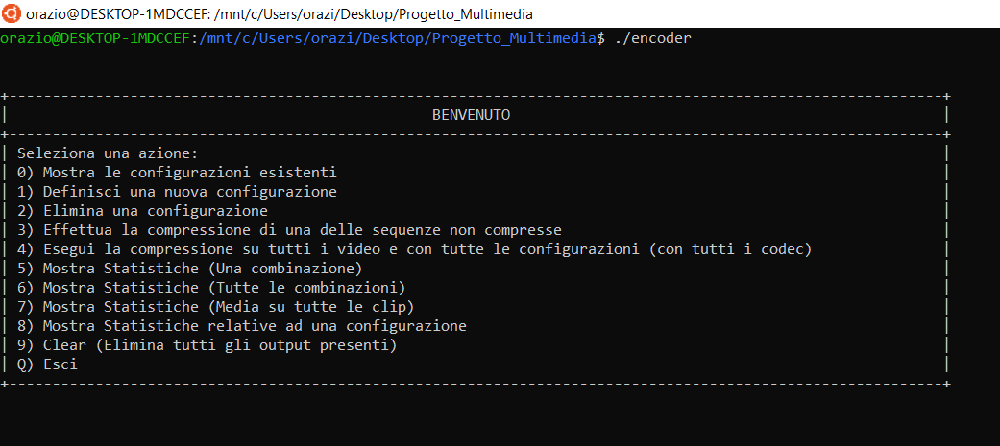
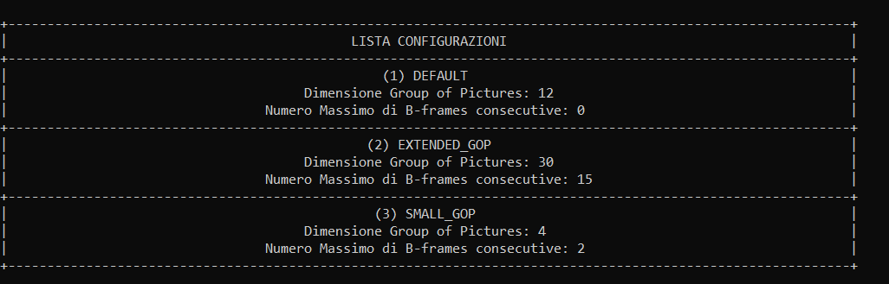

# Progetto_Multimedia
Wrapper for Ffmpeg that allows the definition of customized configurations for the compression and the visualization of the results obtained in terms of compression ratio, execution time and output quality (SSIM and PSNR metrics).

## Table of Contents

- [References](#references)
- [Screenshots](#screenshots)
- [Requirements](#requirements)
- [Dependencies](#dependencies)
- [Testing](#running-for-test)


## References

References available (italian only) at:
- doc/Relazione.pdf


## Screenshots





## Requirements

- C++ compiler


## Dependencies

- FFMpeg


## Running
Once you have installed FFMpeg on your system you can execute the tool following the next steps

#### 1 - Clone the project
- Start Command Prompt window (cmd.exe).
- On the command line, write
  - ```git clone https://github.com/orazioscavo13/Progetto_Multimedia.git ```

#### 2 - Compile and run the project
- Compile the souce file "video_encoder.cpp" (you can use any C++ compiler depending on the system you are using)
- Run the output executable (IMPORTANT: The executable has to be located at the same location of the "video_encoder.cpp" file)
